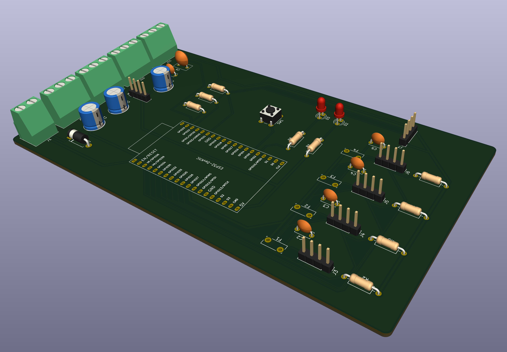
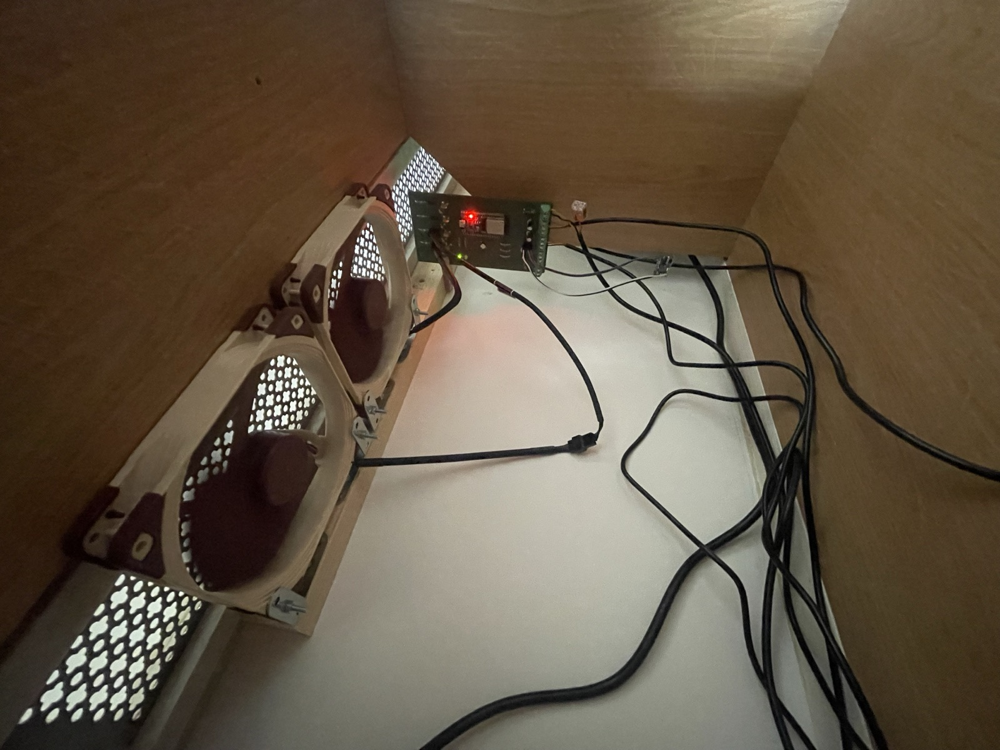
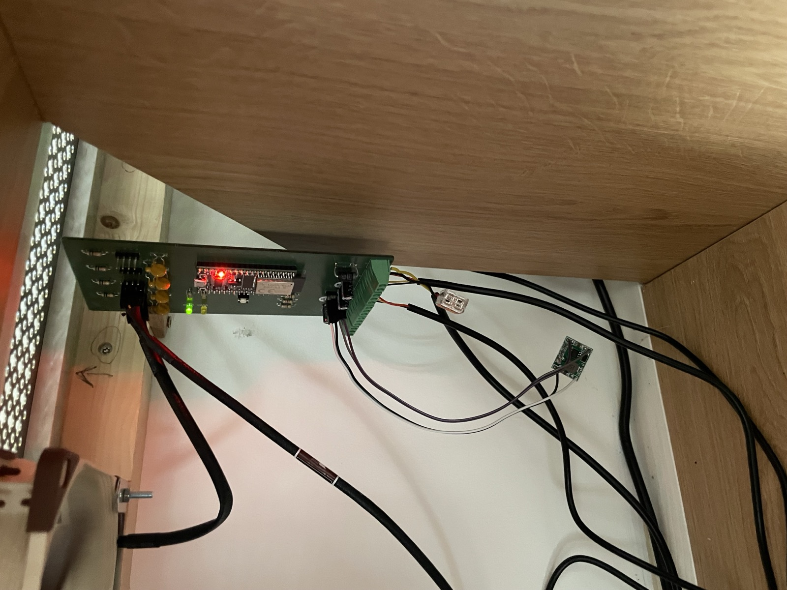
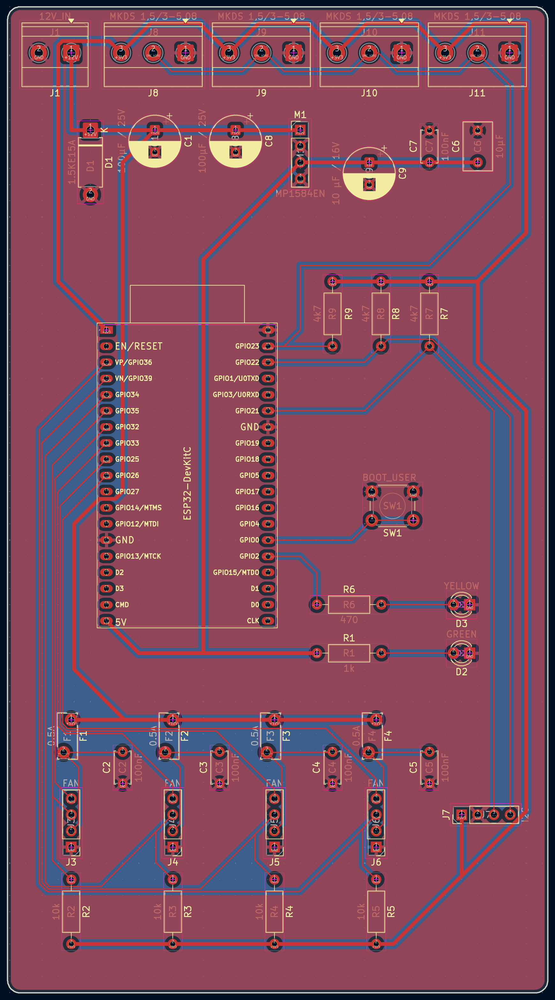
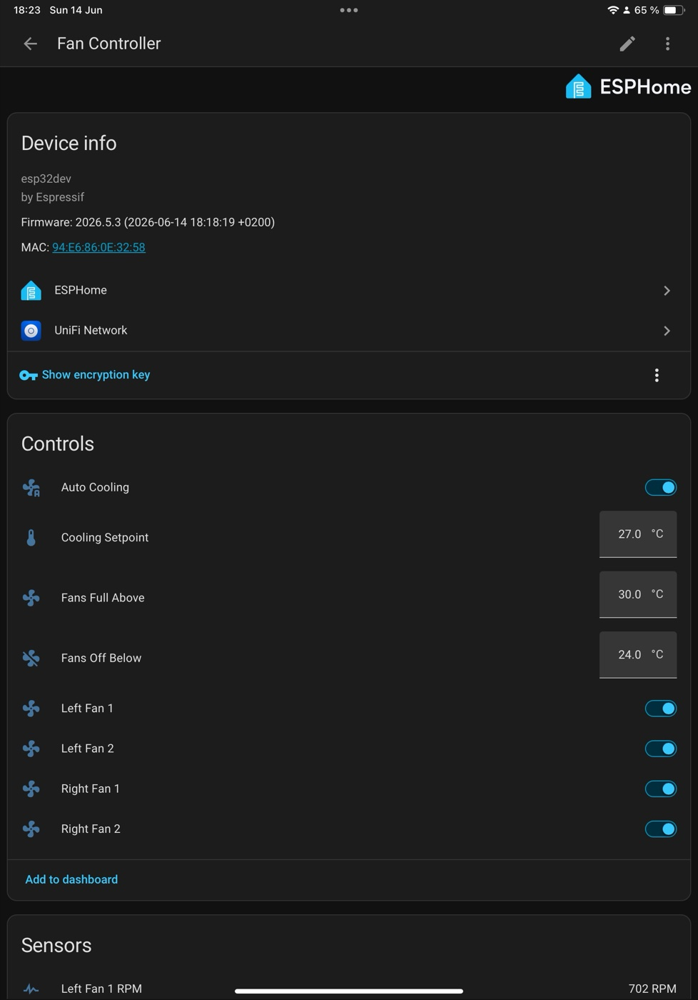
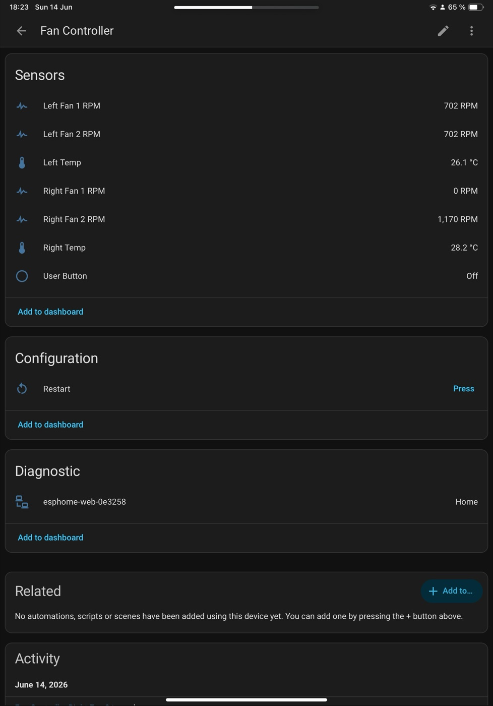
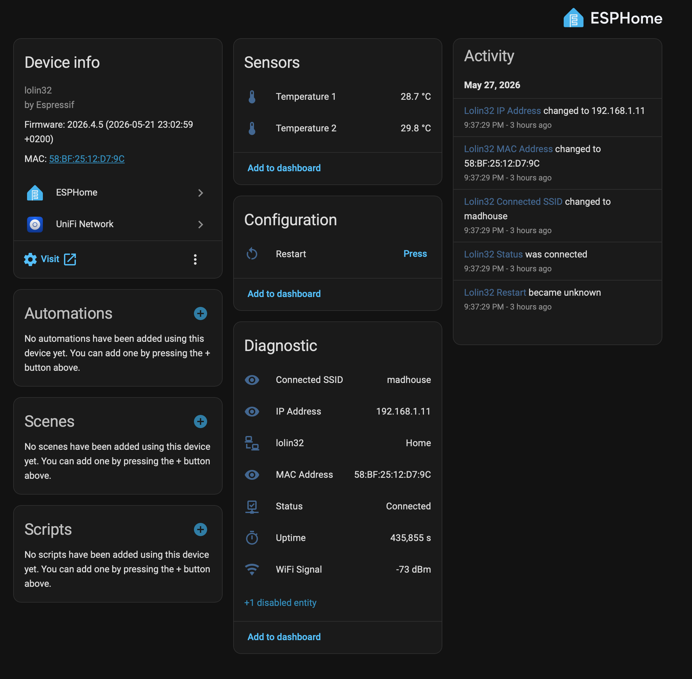
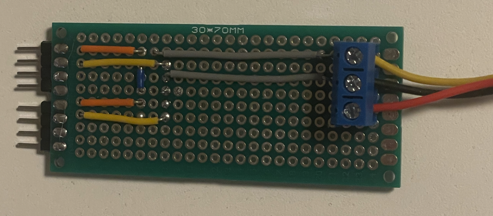
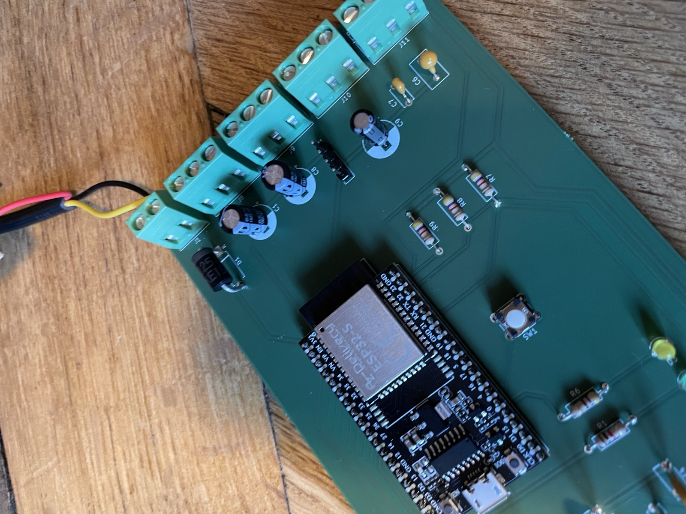

<div align="center">

# ESP32 Fan Controller

**A small KiCad board to keep my home server cabinet cool. 4 PWM fans, 4 temperature probes, one ESP32.**

[](LICENSE)
[](#roadmap)
[](https://www.kicad.org/)
[](#)
[](#)
[](firmware/fancontroller.yaml)

<a href="docs/images/pcb-3d-render.png"></a>

</div>

## Why this exists

My home servers live in a small cabinet, hidden inside a piece of furniture I built around them. It is a credenza with a stone top, a perforated metal grille set into that top so the warm air can escape upward, and cane mesh side panels so fresh air can come in from below.

The room itself has air conditioning, but the cabinet does not. Without something actively pushing the warm air out, it just stacks up under the stone. So I needed a way to manage the airflow.

<table align="center">
  <tr>
    <td align="center">
      <a href="docs/images/server-cabinet.jpg"></a>
    </td>
  </tr>
  <tr>
    <td align="center"><sub>The cabinet. Stone top with the perforated exhaust grille against the wall, servers behind the cane mesh panels.</sub></td>
  </tr>
</table>

I started with two breadboard prototypes (see [How I got here](#how-i-got-here)). The first one was just about understanding the temperatures: where to put the probes, where it actually gets hot. The second one was for the fans, to see how they really move the air through that perforated stone grille.

Once both questions were answered, I designed this PCB. It is a small two layer board, all through-hole so I can solder it by hand on a Sunday afternoon, around €14 in parts. It runs [ESPHome](https://esphome.io/), which means it shows up directly in Home Assistant without writing any firmware.

The board is now soldered, mounted at the back of the cabinet, and the firmware in [`firmware/fancontroller.yaml`](firmware/fancontroller.yaml) keeps the two pairs of fans (one per side of the cabinet) under thermostatic control. A short press on the on-board button toggles between auto and manual; the yellow LED reflects that state.

<table align="center">
  <tr>
    <td align="center" width="50%">
      <a href="docs/images/cabinet-installed.jpg"></a>
    </td>
    <td align="center" width="50%">
      <a href="docs/images/installed-board.jpg"></a>
    </td>
  </tr>
  <tr>
    <td align="center"><sub>Fans pulling air up through the perforated stone grille, controller mounted on the right wall.</sub></td>
    <td align="center"><sub>Board mounted vertically inside the cabinet, screw terminals on top, ESP32 power LED on.</sub></td>
  </tr>
</table>

## Contents

- [Features](#features)
- [Hardware overview](#hardware-overview)
  - [ESP32 GPIO map](#esp32-gpio-map)
- [Firmware (ESPHome)](#firmware-esphome)
- [How I got here](#how-i-got-here)
- [Build one yourself](#build-one-yourself)
- [Repository layout](#repository-layout)
- [Roadmap](#roadmap)
- [License](#license)
- [Thanks](#thanks)

## Features

- 4 independent PWM fan channels (designed around Noctua NF-A14 PWM, but any standard 4-pin PC fan works)
- 4 tachometer (RPM) inputs, open-collector, with on-board pull-ups to 3.3 V
- 4 DS18B20 1-Wire temperature probes on a shared bus (single 4.7 kΩ pull-up)
- Single 12 V external input. An on-board MP1584EN buck module generates the 5 V for the ESP32
- Per-fan PTC fuse and a TVS diode at the 12 V input, for protection
- I²C expansion header (3.3 V / GND / SDA / SCL)
- Two indicator LEDs: a green one for power (lit when the 5 V rail is up) and a yellow one for status (driven by GPIO 2)
- A small tactile button for boot / user input, shared with GPIO 0
- Everything through-hole, so it can be hand-soldered without a reflow oven
- Bare board, 155 × 85 mm, with M3 mounting holes

## Hardware overview

| Block      | Component                                                       |
|------------|-----------------------------------------------------------------|
| MCU        | ESP32 DevKitC V4 (AZDelivery, 100 % Espressif layout)           |
| Power      | External 12 V / 2 A PSU, then on-board MP1584EN buck to 5 V     |
| Fans       | 4 Noctua NF-A14 PWM, plugged into 4-pin headers                 |
| Sensors    | 4 DS18B20 waterproof probes on screw terminals                  |
| Protection | 1.5KE15A TVS on the 12 V input, 4 MF-R050 PTC fuses on the fans |
| Enclosure  | No enclosure for v1, just M3 mounting holes on the bare board   |

PCB is two-layer, 155 × 85 mm, 1.6 mm thick.

<table align="center">
  <tr>
    <td align="center" width="50%">
      <a href="docs/images/pcb-layout.png"></a>
    </td>
    <td align="center" width="50%">
      <a href="docs/images/pcb-3d-render.png"></a>
    </td>
  </tr>
  <tr>
    <td align="center"><sub>2D layout. F.Cu in red, B.Cu in blue.</sub></td>
    <td align="center"><sub>KiCad 3D render of the assembled board.</sub></td>
  </tr>
</table>

### ESP32 GPIO map

| Connector | Side  | PWM (out) | Tach (in) |
|-----------|-------|-----------|-----------|
| J3        | Right | GPIO 32   | GPIO 35   |
| J4        | Right | GPIO 33   | GPIO 34   |
| J5        | Left  | GPIO 25   | GPIO 39   |
| J6        | Left  | GPIO 26   | GPIO 36   |

| Pin     | Use                              |
|---------|----------------------------------|
| 23      | 1-Wire bus (DS18B20 probes)      |
| 21 / 22 | I²C SDA / SCL                    |
| 2       | Status LED (D3 yellow, R6 470 Ω) |
| 0       | Boot / user button (SW1)         |

The probe on J8 covers the left fans (J5 + J6), the probe on J9 covers the right ones (J3 + J4). All four DS18B20 sockets (J8–J11) sit on the same 1-Wire bus, so the assignment is by ROM address in the YAML.

## Firmware (ESPHome)

The shipped firmware is [`firmware/fancontroller.yaml`](firmware/fancontroller.yaml). It exposes, in Home Assistant:

- Two fan controls (`Left Fans`, `Right Fans`), each driving that side's two fans in lockstep, plus an individual RPM sensor per physical fan (four in total, so a single seized fan is still visible)
- Two temperature probes (`Left Temp`, `Right Temp`) with their DS18B20 ROM addresses pinned
- A single `Auto Cooling` switch and three `Number` entities (`Cooling Setpoint`, `Fans Off Below`, `Fans Full Above`)
- A `Restart` button and a `User Button` binary sensor for the on-board SW1

When `Auto Cooling` is on, each side runs the same linear ramp on its own probe:

```
T ≤ Off Below            →   0 %     (silent)
Off Below < T < Setpoint →   0 → 60 % (gentle correction)
Setpoint ≤ T < Full Above → 60 → 100 % (aggressive)
T ≥ Full Above           → 100 %     (max effort)
```

The setpoint sits inside the band on purpose, so a stable cabinet parks the fans at around 60 % instead of oscillating between full speed and off. All three thresholds are editable live from HA; defaults are 24 / 27 / 30 °C.

The on-board button toggles `Auto Cooling` on a short press, and reboots the ESP32 on a 3 s+ hold. The yellow LED follows `Auto Cooling`: on in auto, off in manual.

<table align="center">
  <tr>
    <td align="center" width="50%">
      <a href="docs/images/ha-controls.jpg"></a>
    </td>
    <td align="center" width="50%">
      <a href="docs/images/ha-sensors.jpg"></a>
    </td>
  </tr>
  <tr>
    <td align="center"><sub>Device controls: auto cooling, thresholds, per-side fan toggles.</sub></td>
    <td align="center"><sub>Sensors: per-side RPM and temperature.</sub></td>
  </tr>
</table>

The build / flash / dashboard commands are wrapped in a [`Taskfile.yml`](Taskfile.yml). With [Task](https://taskfile.dev/) installed (`brew install go-task`):

```
task               # list available tasks
task config        # validate the YAML
task upload        # compile and OTA-flash fancontroller.local
task flash-usb PORT=/dev/cu.wchusbserial8330   # first-time USB flash
task logs          # stream logs over the network
task dashboard     # local ESPHome dashboard on :6052
```

Before the first flash, copy `firmware/secrets.example.yaml` to `firmware/secrets.yaml` and fill it in (Wi-Fi, API key, OTA password). `secrets.yaml` is git-ignored.

## How I got here

Before committing to a PCB, I validated the design with two breadboard stages.

### Stage 1, temperature monitoring with Home Assistant

I started with an ESP32 **LoLin** board and **two DS18B20 probes**, flashed with [ESPHome](https://esphome.io/) and added to Home Assistant. The question for this stage was simple: what does the temperature actually do in the server cabinet? It gave me the baseline graphs that justified active cooling, and it told me where the probes should sit (intake, exhaust, ambient).

The ESPHome YAML I used is kept here for reference: [`docs/stage1-lolin32-esphome.yaml`](docs/stage1-lolin32-esphome.yaml). Shared 1-Wire bus on GPIO 4, two `dallas_temp` entries by 64-bit address.

<table align="center">
  <tr>
    <td align="center" width="50%">
      <a href="docs/images/proto-lolint-esp.jpg"></a>
    </td>
    <td align="center" width="50%">
      <a href="docs/images/homeassistant-esphome.png"></a>
    </td>
  </tr>
  <tr>
    <td align="center"><sub>ESP32 LoLin with two DS18B20 probes.</sub></td>
    <td align="center"><sub>Home Assistant device page, both probes live (28.7 °C and 29.8 °C).</sub></td>
  </tr>
</table>

### Stage 2, the fan bench

For the second stage, I drove a fan directly from a separate breadboard, to actually measure how the airflow influences the temperature. Fan position, speed versus Δtemperature, how fast the cabinet responds. This is where I confirmed that the Noctua NF-A14 was the right fan, validated the PWM strategy, and figured out the per-fan power budget.

<table align="center">
  <tr>
    <td align="center">
      <a href="docs/images/proto-fan-bench.jpg"></a>
    </td>
  </tr>
  <tr>
    <td align="center"><sub>Fan power and airflow test on a 30 × 70 mm protoboard.</sub></td>
  </tr>
</table>

The PCB in this repository is the consolidation of both stages: 4 probes (intake, exhaust, two ambient) and 4 PWM-controlled fans on a single board instead of breadboards.

## Build one yourself

1. **Order the bare PCB.** Any fab works, I used [Aisler](https://aisler.net/). You can upload `kicad/esp32-fan-controller.kicad_pro` directly, or export gerbers first if your fab needs them.
2. **Order the parts**, around €14 excluding VAT and shipping. The quick-paste block in [`bom/ORDER.md`](bom/ORDER.md) is verified against live Farnell France stock. Paste it into Farnell's Quick Paste / Multi-Add tool. The full BOM with notes is in [`BOM.md`](BOM.md).
3. **Pre-set the MP1584EN buck module to 5.00 V before soldering it in.** Apply 12 V on its input with a bench supply, and turn the trimpot until the output reads 5.00 V.
4. **Hand-solder.** All through-hole. The order I would suggest: passives, then diodes and LEDs, then sockets and headers, then screw terminals, and finally the ESP32 socket.
5. **Power-up check.** 12 V on J1, confirm 5 V at the M1 output pin, then plug in the ESP32. Watch the polarity at J1: D1 is a 1.5KE15A TVS, so a reversed wire short-circuits the input through the diode.

<table align="center">
  <tr>
    <td align="center">
      <a href="docs/images/assembled-board.jpg"></a>
    </td>
  </tr>
  <tr>
    <td align="center"><sub>Mid power-up check: 12 V test leads on J1 before plugging in the ESP32.</sub></td>
  </tr>
</table>

6. **Flash [ESPHome](https://esphome.io/).** First time over USB, after that over the air:

   ```
   cp firmware/secrets.example.yaml firmware/secrets.yaml   # fill in Wi-Fi etc.
   task flash-usb PORT=/dev/cu.wchusbserial...              # initial flash
   task upload                                              # subsequent OTAs
   ```

   Details in [Firmware (ESPHome)](#firmware-esphome).

## Repository layout

```
.
├── kicad/                            # KiCad 10 project (schematic and PCB)
├── firmware/                         # ESPHome YAML for the v1 board
│   ├── fancontroller.yaml            # Shipped firmware
│   └── secrets.example.yaml          # Template for secrets.yaml (git-ignored)
├── bom/                              # BOM CSV and ordering sheets
│   └── orders/                       # Generated distributor cart CSVs
├── docs/
│   ├── images/                       # Photos, schematic renders, screenshots
│   └── stage1-lolin32-esphome.yaml   # ESPHome config used on the temperature prototype
├── BOM.md                            # Human-readable BOM with notes
├── Taskfile.yml                      # `task config / upload / logs / dashboard`
├── LICENSE                           # MIT
└── README.md
```

## Roadmap

**Next**

- [ ] Replace the missing right-side fan (J4) once the second NF-A14 arrives
- [ ] Long-term temperature graph in Grafana, to see how the auto-cooling curve actually plays out over a week

**Later**

- [ ] An actual enclosure for the PCB. The CamdenBoss CNMB/9 DIN-rail kit is a candidate, the board is already short-edge-connector friendly
- [ ] A v2 silkscreen polish, based on what I learned during assembly (polarity marks on J1, clearer pin-1 on the fan headers)

**Done**

- ✅ Schematic, ERC clean
- ✅ PCB layout, DRC clean, 0 violations, 0 unconnected
- ✅ Bare PCB ordered (Aisler)
- ✅ BOM verified against live Farnell stock
- ✅ Components ordered (Farnell)
- ✅ Board assembled and brought up on the bench
- ✅ Mounted in the cabinet, three fans and two DS18B20s live
- ✅ ESPHome config shipped: two per-side fan groups (4 PWM channels, 4 RPM sensors), 2 temp probes, thermostatic auto-cooling, button + LED status

## License

MIT, see [LICENSE](LICENSE). Hardware design files are released under the same terms, so feel free to fork, modify, fabricate and share.

## Thanks

- The KiCad team for the EDA suite
- Espressif for the ESP32 and the DevKitC reference design
- AZDelivery for an affordable ESP32 DevKitC V4 clone
- [ESPHome](https://esphome.io/), which turned the Stage 1 prototype into a one evening job
- [openotters](https://github.com/openotters/openotters), which I used as a template for this README
